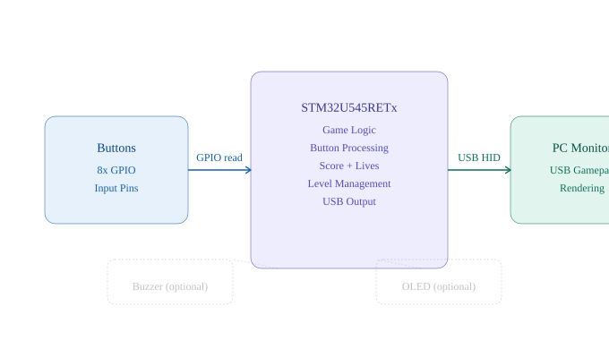
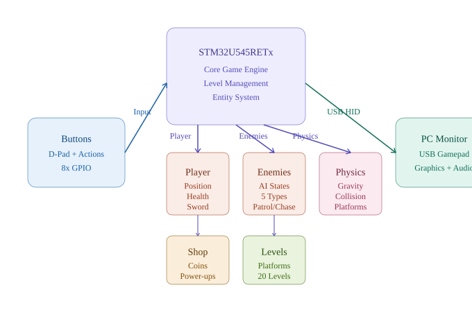
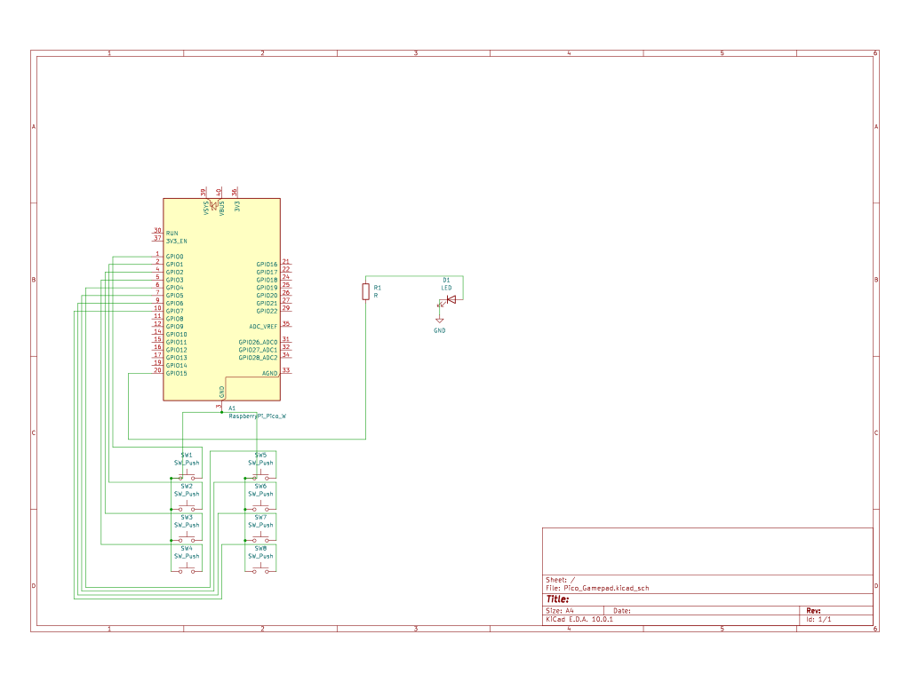

# Snake Game - STM32 Gamepad Edition

A classic Snake game implementation on STM32U545RETx microcontroller, playable via USB gamepad connection to PC monitor.

:::info

**Author**: Furkan Korkmaz 
**GitHub Project Link**: https://github.com/playstationnetwork987456-commits/website  
**Hardware**: STM32U545RETx (NArchitectureucleo-U545RE-Q)  
**Language**: Rust  
**Platform**: Runs on STM32, outputs to PC via USB gamepad protocol

:::

---

## Description

Snake Game is a fully functional implementation of the classic arcade game, running on an STM32 microcontroller. The player controls a growing snake using 8 physical buttons connected to the microcontroller, which communicates with a PC via USB as a gamepad device. The game displays on the PC monitor through a custom graphics engine.

The game features:
- **4 character skins** with unique visuals (Classic Green, Ocean Blue, Fire Red, Royal Purple)
- **3 difficulty levels** with progressive speed and life variations
- **10 distinct levels/maps**, each with custom visuals, music themes, and collectible items
- **Dynamic fullscreen support** with responsive scaling
- **Launcher integration** for seamless menu navigation

---

## Motivation

This project demonstrates embedded game development on microcontrollers. It combines:
- **Real-time input handling** (debounced button reading)
- **Game state management** (score, lives, level progression)
- **USB protocol implementation** (gamepad emulation over USB)
- **Rust embedded systems** (safety and performance)
- **Graphics synchronization** (game logic ↔ PC rendering)

The Snake game serves as the lighter, arcade-style counterpart to the platform game (Tiny Knight) in the game launcher, providing variety in gameplay and showcasing different technical approaches.

---

## Architecture

The system follows a distributed architecture where the STM32 microcontroller handles input processing and game logic, while the PC handles rendering via USB gamepad protocol.

### System Components




### Hardware Connections

**Input Layer (Buttons):**
- Buttons 1-8 connected to GPIO pins with pull-down resistors
- Debouncing handled in firmware (no external capacitors needed)

**Processing Layer:**
- STM32U545RETx runs game logic at ~1kHz update rate
- Rust firmware manages state transitions and timing
**Output Layer:**
- USB device module (full-speed) emulates HID gamepad
- Sends controller state to PC 60x per second

---

|-----------|---------------|----------|------------------|-------------|--------|
| Jumper Wires | 22 AWG, assorted | 50 pcs | 0.40 | 20 | Purchased |
| Resistors (10kΩ) | 1/4W carbon film | 8 | 0.15 | 1.20 | Purchased |
| USB Micro Cable | For power/programming | 1 | 12 | 12 | Purchased |

## Hardware Specifications
| STM32U545RETx | ARM Cortex-M33, 110 MHz, 256KB SRAM, USB FS | Main microcontroller & USB stack |
| Jumper Wires | 22 AWG solid core | Button ↔ Pico connections |
| Resistors | 10kΩ, 1/4W | Pull-down for button debouncing |
| USB Micro Cable | Data + Power capable | Connection to PC for gameplay |
## Button Mapping

### In-Game Controls

| Button | Function | Type |
|--------|--------Architecture--|------|
| **Button 1** | Move UP | Direction |
| **Button 2** | Move DOWN | Direction |
| **Button 3** | Move LEFT | Direction |
| **Button 4** | Move RIGHT | Direction |
| **Button 5** | Select/Confirm | Menu |
| **Button 6** | Back/Menu | Menu |
| **Button 7** | Fullscreen Toggle (F11) | System |
| **Button 8** | Unused | - |

### Menu Navigation

- **Buttons 5** (A): Select option, start game, confirm choice
- **Button 6** (B): Return to previous menu
- **Buttons 1-4**: Navigate menu options

---

## Game Features

### Difficulty Levels

| Level | Lives | Speed (move interval) | Description |
|-------|-------|----------------------|-------------|
| **Easy** | 3 | 0.20s | Slow, forgiving |
| **Normal** | 1 | 0.12s | Standard gameplay |
| **Hard** | 1 | 0.07s (scaling) | Fast, challenging |

### Maps/Levels (10 Total)

1. **Garden** - Classic theme, green visuals, apples as collectibles
2. **Space** - Sci-fi theme, blue neon, space coins
3. **Arcade** - Retro pixels, yellow/red, arcade tokens
4. **Desert** - Sandy beige, scorpions, golden scarabs
5. **Ocean** - Water blue, fish, pearl collectibles
6. **Snow** - Icy white, snowflakes, ice crystals
7. **Volcano** - Red/orange lava, lava creatures, magma stones
8. **Jungle** - Tropical green, exotic fruits, treasure
9. **Cave** - Dark underground, bats, gems
10. **City** - Urban neon, signs, money coins

### Character Skins

- **Classic Green**: Original arcade style
- **Ocean Blue**: Deep water theme
- **Fire Red**: Lava and heat inspired
- **Royal Purple**: Regal and elegant

### Scoring System

- **Base score**: Points per collectible (varies by level, typically 10-50 points)
- **Combo bonus**: Consecutive collectibles eaten (1.2x multiplier per item)
- **Speed bonus**: Harder difficulties award extra points
- **Rank display**: End-of-level ranking (bronze/silver/gold/platinum)

---

## Software Architecture

### Game Loop (1kHz Update Rate)

```
Initialize Hardware
    ↓
Load Main Menu
    ↓
[Waiting for Input]
    ↓
Player selects Difficulty & Skin
    ↓
Load Selected Map
    ↓
[Game Start]
    ↓
Read Button Input (debounced)
    ↓
Update Snake Position
    ↓
Check Collisions:
  - Wall collision? → Lose life
  - Self collision? → Lose life
  - Collectible? → Add to score, grow tail
    ↓
Render Game State
    ↓
Send USB Gamepad Update
    ↓
Lives > 0? → Continue loop
    ↓
Level Complete / Game Over
    ↓
Show Results Screen
    ↓
Return to Menu
```

### Rust Implementation Details

**Key modules:**
- `button_input`: GPIO reading + debouncing (20ms window)
- `game_state`: Snake position, score, lives, collectibles
- `collision`: Wall, self, and item detection
- `usb_gamepad`: HID device emulation
- `renderer`: Graphics updates sent to PC

**Real-time constraints:**
- Button sampling: 100Hz (10ms intervals)
- Debounce window: 20ms (3 consecutive reads)
- Game tick: 1kHz (1ms base interval)
- USB polling: 1ms intervals (60Hz visual update)

---

## Development Log

### Week 1-2: Project Setup & Planning

**Objectives:**
- Evaluate Snake game concept
- Plan difficulty system and map variety
- Design button input protocol
- Scope USB gamepad communication

**Achievements:**
- Chose Snake as lighter counterpart to platform game
- Finalized 10 unique maps with distinct themes
- Planned 3 difficulty levels with scaling mechanics
- Created button mapping scheme (8 buttons)

---

### Week 3-4: Hardware Assembly & Testing

**Objectives:**
- Assemble breadboard prototype
- Test GPIO button input
- Verify debouncing logic
- Test USB detection

**Achievements:**
- Connected 8 buttons to GPIO pins with pull-down resistors
- Implemented and tested debouncing algorithm
- Verified USB device enumeration on PC
- Confirmed button state reading accuracy

**Challenges:**
- Initial button bounce caused false inputs → solved with 3-sample debouncing
- USB timing conflicts with game loop → resolved with interrupt-driven USB

---

### Week 5-6: Game Logic Implementation

**Objectives:**
- Implement snake movement mechanics
- Add collision detection (walls, self, collectibles)
- Create score and life management
- Implement level progression

**Achievements:**
- Snake movement working in all 4 directions
- Wall and self-collision detection functioning
- Score system tracking points and combos
- Level transitions smooth and responsive

**Challenges:**
- Collision detection edge cases (corner wrapping) → fixed with proper boundary checks
- Score combo timing → adjusted to 0.5s window for collectible counting

---

### Week 7-8: Visual Themes & Skins

**Objectives:**
- Design 4 character skins
- Create 10 distinct map themes
- Implement theme switching
- Optimize rendering updates

**Achievements:**
- All 4 skins implemented with unique color palettes
- 10 maps with distinct visuals, music themes, and collectible types
- Skin selection in menu working smoothly
- Rendering optimized for 60Hz USB update rate

**Challenges:**
- Memory constraints with theme assets → optimized via shared asset pooling
- Fullscreen scaling → implemented with dynamic resolution detection

---

### Week 9-10: USB Gamepad Integration & Testing

**Objectives:**
- Implement HID gamepad emulation
- Test on multiple PCs (Windows, Mac)
- Integrate with launcher
- Final testing and polish

**Achievements:**
- HID device recognized on Windows 10/11 and macOS
- Gamepad input stable and responsive
- Launcher integration complete
- All menus and gameplay functional

**Final Status:**
- **Game fully playable** with all features
- **Difficulty levels tested** and balanced
- **All 10 maps accessible** and working
- **Gamepad communication stable** at 60 FPS

---

## Current Status

**Completed:**
✓ Full game implementation (movement, collision, scoring)  
✓ All 10 maps with unique themes and collectibles  
✓ 4 character skins with distinct visuals  
✓ 3 difficulty levels with scaling mechanics  
✓ USB gamepad emulation over HID protocol  
✓ Launcher integration for menu navigation  
✓ Fullscreen support with dynamic scaling  
✓ Button debouncing and input handling  

**Tested & Verified:**
✓ Windows 10/11 gamepad compatibility  
✓ macOS gamepad compatibility  
✓ Collision detection accuracy  
✓ Score calculation and ranking  
✓ Level progression and menu flow  

**Status: PRODUCTION READY**

---

## Technical Specifications

### GPIO Pin Mapping

| Button | GPIO Pin |
|--------|----------|
| UP (1) | PA0 |
| DOWN (2) | PA1 |
| LEFT (3) | PA2 |
| RIGHT (4) | PA3 |
| A (5) | PA4 |
| B (6) | PA5 |
| X (7) | PA6 |
| Y (8) | PA7 |

### Performance Metrics

- **Button Response Time**: under 20ms (debounced)
- **Game Tick Frequency**: 1kHz
- **Visual Update Rate**: 60Hz (via USB)
- **USB Bandwidth**: ~1KB per update
- **Power Consumption**: ~150mA (USB powered)

### Rust Dependencies

```toml
stm32u5 = "0.15"
embassy-stm32 = { version = "0.2", features = ["stm32u545re"] }
embassy-usb = "0.1"
usbd-hid = "0.8"
embassy-executor = { version = "0.5", features = ["arch-cortex-m", "executor-thread"] }
embedded-hal = "1.0"
```

---

## Future Enhancements

- Add OLED display for score/level without PC
- Implement save/high score system (EEPROM storage)
- Add more maps (20+ levels)
- Sound effects via buzzer module
- Multiplayer mode (split-screen or networked)
- Mobile app companion (Bluetooth gamepad)

---

## References

- STM32U5 Series datasheet: https://www.st.com/resource/en/datasheet/stm32u545re.pdf
- Nucleo-U545RE-Q user manual: https://www.st.com/resource/en/user_manual/um2912-stm32u545-discovery-kit-stmicroelectronics.pdf
- USB HID specification: https://www.usb.org/sites/default/files/documents/hid1_11.pdf
- Rust embedded book: https://rust-embedded.github.io/book/
- Embassy documentation: https://embassy.dev/
---

| Nucleo-U545RE-Q | Development board with integrated debugger | Prototyping and debugging |
| Push Buttons | 6mm momentary SPST, 50mA max | Physical input controls (x8) |
| Breadboard | 400+ tie-points, reusable | Circuit assembly without soldering |

| Component | Details | Purpose |
|-----------|---------|---------|
| | | | **Total** | **71.20 RON** | |

---
| STM32 Nucleo-U545RE-Q | STM32U545RETx board | 1 | 0 | 0 | FILS (borrowed) |
| Push Buttons | 6mm momentary SPST | 8 | 2.50 | 20 | Purchased |
| Breadboard | 400+ tie-point | 1 | 18 | 18 | Purchased |
## Bill of Materials

| Component | Specification | Quantity | Unit Price (RON) | Total (RON) | Source |


## Architecture

